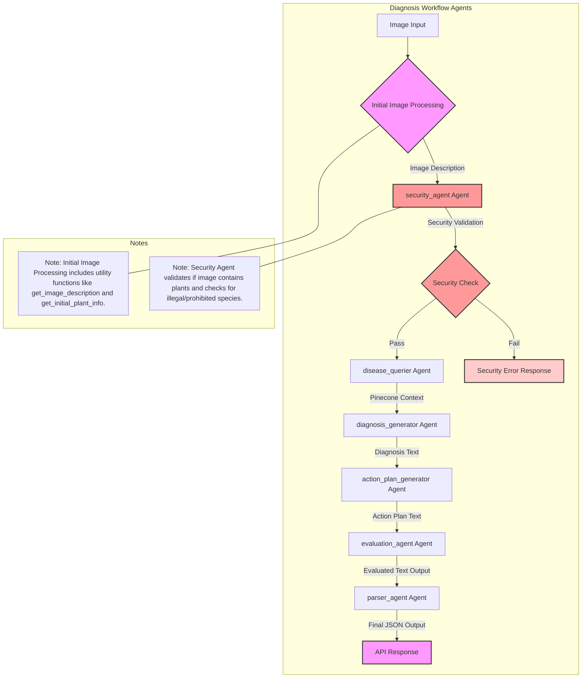

```mermaid
graph TD
    subgraph Diagnosis Workflow Agents
        A[Image Input] --> B{Initial Image Processing}
        B -->|Image Description| C[security_agent Agent]
        C -->|Security Validation| D{Security Check}
        D -->|Pass| E[disease_querier Agent]
        D -->|Fail| I[Security Error Response]
        E -->|Pinecone Context| F[diagnosis_generator Agent]
        F -->|Diagnosis Text| G[action_plan_generator Agent]
        G -->|Action Plan Text| H[evaluation_agent Agent]
        H -->|Evaluated Text Output| J[parser_agent Agent]
        J -->|Final JSON Output| K[API Response]
    end

    style B fill:#f9f,stroke:#333,stroke-width:2px
    style C fill:#ff9999,stroke:#333,stroke-width:2px
    style D fill:#ff9999,stroke:#333,stroke-width:2px
    style I fill:#ffcccc,stroke:#333,stroke-width:2px
    style K fill:#f9f,stroke:#333,stroke-width:2px

    %% Notes on B (Initial Image Processing)
    subgraph Notes
        note1[Note: Initial Image Processing includes utility functions like get_image_description and get_initial_plant_info.]
        note2[Note: Security Agent validates if image contains plants and checks for illegal/prohibited species.]
    end
    B --- note1
    C --- note2
```