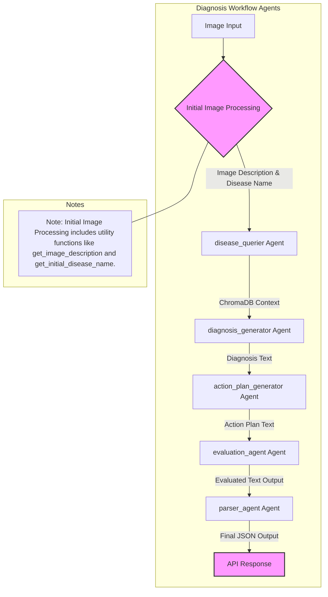

```mermaid
graph TD
    subgraph Diagnosis Workflow Agents
        A[Image Input] --> B{Initial Image Processing}
        B -->|Image Description & Disease Name| C[disease_querier Agent]
        C -->|ChromaDB Context| D[diagnosis_generator Agent]
        D -->|Diagnosis Text| E[action_plan_generator Agent]
        E -->|Action Plan Text| F[evaluation_agent Agent]
        F -->|Evaluated Text Output| G[parser_agent Agent]
        G -->|Final JSON Output| H[API Response]
    end

    style B fill:#f9f,stroke:#333,stroke-width:2px
    style H fill:#f9f,stroke:#333,stroke-width:2px

    %% Notes on B (Initial Image Processing)
    subgraph Notes
        note1[Note: Initial Image Processing includes utility functions like get_image_description and get_initial_disease_name.]
    end
    B --- note1
```